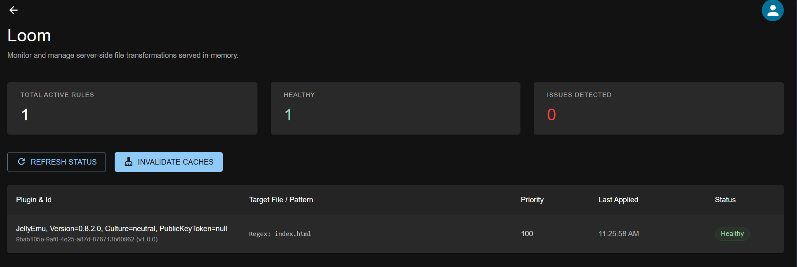

  
  <h1>Loom</h1>
  
A plugin for jellyfin 10.11+ modify index.html in jellyfin, a thoughtful remake of file transformation plugin.

  
  
  

---

## Screenshots

  

  <em>Click on an image to view it full size.</em>

