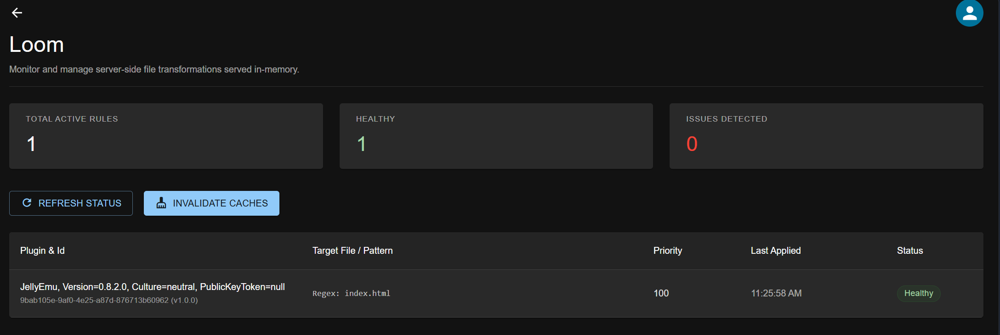

  
  
   
  
  
  

  
  <h1>Loom</h1>
  
A plugin for modifying the frontend ui, and a thoughtful remake of file transformation plugin.

  <h3>Jellyfin Support</h3>

  
  

  <h3>Important Links</h3>

  
  
  

---

## Screenshots

  

  <em>Click on an image to view it full size.</em>

